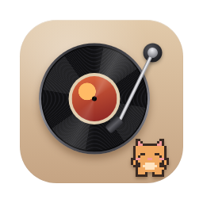

<p align="center"></p>

# Vinyl Player

A tiny turntable for the Mac desktop. A little pixel pet lives on top of it: it walks over to lower or lift the tonearm when you press play or pause, swaps records when the song changes, and dances to the beat while music plays.

What's included:

- **Desktop player:** a borderless window pinned to the desktop (behind your other windows) with all the animation.
  - The record spins in 3D and resumes from the same angle.
  - The tonearm drops and lifts, and follows the groove.
  - The pet walks over, works the arm, swaps and flips records, dances, blinks, dozes off and unlocks headphones.
  - Covers are the real album art, and the colours come from the cover.
  - The crate has Up next, record colours and pets.
  - You can share a song as a record.
- **Widgets:** small, medium and large widgets for the desktop and Notification Center. They show the cover, song and pet, and have working play/pause and skip buttons.
- **Menu bar app:** a record icon in the menu bar with controls and settings. There's no Dock icon.

It follows what's playing in the **Spotify** or **Music** app on your Mac (no sign-in needed), or plays six built-in sample songs.

## Install

Every change pushed to `main` is built automatically on GitHub and published as **[VinylPlayer.dmg](https://github.com/azhaf7/vinyl-player/releases/download/latest/VinylPlayer.dmg)** (also under **Releases → latest**).

1. Download **VinylPlayer.dmg** and open it.
2. Drag **Vinyl Player** onto the **Applications** folder in the window.
3. The app isn't notarized by Apple yet, so macOS blocks it the first time. Open **Terminal** and run:
   ```
   xattr -dr com.apple.quarantine "/Applications/Vinyl Player.app"
   ```
   Or try to open it once, click **Done**, then go to **System Settings → Privacy & Security** and click **Open Anyway**.
4. Open **Vinyl Player**. The turntable appears at the top right of the desktop, and a record icon appears in the menu bar.
5. Play a song in Spotify or Apple Music. The first time, macOS asks to let Vinyl Player control the app: click **OK**.

The downloaded build has the full desktop player and pet. The **widgets need a signed build**, either one you build with Xcode (below) or a notarized release, because macOS only loads widgets from signed apps.

## Build it yourself with Xcode

### Requirements

- A Mac with **macOS 14 Sonoma** or later.
- **Xcode 16** or later (free from the Mac App Store).
- A free **Apple ID** to sign the app so it runs on your Mac.

### Run it

1. Clone or download this repository, then double-click **`VinylPlayer.xcodeproj`** to open it in Xcode.
2. Add your Apple ID if Xcode doesn't have it yet: **Xcode → Settings → Accounts → +**.
3. Click the blue **VinylPlayer** project at the top of the left sidebar. Set up signing for **both** targets:
   1. Select **VinylPlayer**, open **Signing & Capabilities**, and set **Team** to your name (Personal Team).
   2. Do the same for **VinylWidgets**.
   3. If Xcode says the bundle identifier is taken, change `com.azhaf7` to something of your own in both targets. Keep the `.widgets` ending on the widget target.
4. Choose **VinylPlayer** and **My Mac** in the toolbar, then press **⌘R** (Product → Run).

The turntable appears at the top right of your desktop, and a record icon appears in the menu bar.

#### Keep it after closing Xcode

Choose **Product → Archive**, then **Distribute App → Copy App**. Drag the exported **Vinyl Player.app** into **Applications**.

To have it start automatically, turn on **Settings… → Open at login** in its menu.

#### Add the widgets

1. Right-click an empty part of the desktop and choose **Edit Widgets…**.
2. Search for **Vinyl**, choose a size, and drag it onto the desktop or into Notification Center.

The app needs to have run at least once first.

## Using it

- **Music:** by default it follows the Spotify or Music app. Play, pause and skip on the turntable control that app, and changes made in the app show up on the turntable. Switch to the sample songs under **Music** in the menu bar menu.
  - If the song doesn't appear, the line under the title says why.
  - If it says **Click to allow access**, click it and turn on Vinyl Player under **Automation**.
- **Play / pause:** the white button, a click on the record, or the menu bar menu. The pet walks over and works the tonearm.
- **Skip:** the back and next buttons. The pet lifts the record out and drops in the next one. With the sample songs, going between song 3 and song 4 flips the record from side A to side B.
- **Scrub:** drag along the progress bar. The tonearm follows.
- **Crate (☰):**
  - **Up next / Recent:** tap a record to play it; ‹ › move along the row.
  - **Records:** pick a vinyl colour, or your own with the colour well under **Custom**.
  - **Pets:** ten pets: Mochi, Bao, Pip, Tofu, Kiki, Nori, Biscuit, Peanut, Quack and Ember. Headphones, sunglasses and a scarf in the album's colour can be switched on and off. Everything is free. The pet waves when a friend's record arrives and dozes when the music stops.
  - **Style:** one-tap themes (Classic, Midnight, Bubblegum, Forest, Ocean) and an accent colour. Settings → Colours → Fine-tune colours has pickers for the deck, record, label ring, card and pet.
- **Share (⇧):** copies a link that opens the song as a sealed record (see below).
- **Wake the pet:** click it after it falls asleep.
- **Size:** Small, Medium (the default) or Large, from the right-click menu, the menu bar menu or Settings.
- **Where it lives:** choose under **Show As** in the menu bar menu (the welcome window asks the first time):
  - **Desktop player:** the full turntable on your desktop.
  - **Notch:** a tiny spinning record and the pet beside the MacBook notch. Hover over it to see the record big with its cover, plus the song, album, controls and progress.
- **Settings:** right-click the turntable, click ⚙ in the crate or the expanded notch, or open Vinyl Player again from Applications. Everything is in the Library's **Settings** tab, so you don't need the menu bar icon (it can be hidden behind the notch on MacBooks).
- **Like a song:** ♥ next to the title, in the notch, in the menu or with ⌃⌥L.
- **Colours:** the 🎨 button on the turntable opens the themes.
- **Keyboard shortcuts (anywhere):** ⌃⌥Space play/pause, ⌃⌥→ next, ⌃⌥← previous, ⌃⌥L like. You can turn them off in Settings.
- **Library (⌘L in the menu):**
  - **Collection** (what you chose to keep):
    - **Liked** and **Playlists:** make playlists from any song (the playlist button on a row) and play them in order through Spotify or the sample songs.
    - **Crate:** flip through your records like a crate at a record shop, with ‹ › or the arrow keys.
    - **Received:** records people sent you as links and you opened on this Mac.
  - **History** (kept automatically):
    - **Played:** every song you've played, with your top songs.
    - **Weekly Recap:** your week in minutes, top artist and top songs, as a card you can copy, save or share.
  - **Settings:** everything else.
- **Sharing:** the share button (⇧) opens the Mac's share menu: AirDrop, Messages, Mail, Notes, Copy Link and the rest. The song goes as a sealed-record link that anyone can open in a browser; people with the app can open it on their turntable, and it's kept under Collection → Received. Song rows in the library have the same Share button.
- **Move the player:** drag it from anywhere: the record, the pet or the buttons. A click still works as a click; only an actual drag moves it.
- **Menu bar → Float Above Windows:** keeps it on top instead of on the desktop.
- **Menu bar → Move Player to Top Right:** brings it back if it gets lost.

## Sharing records

Share links open on [Crate](https://github.com/azhaf7/crate)'s record page,
`https://crate-three-mu.vercel.app/r/`, which anyone can open in a browser: the sealed sleeve, the
record sliding out, and a 30-second preview, with buttons for Spotify and Apple Music. Crate reads the
same link fields this app writes (`song`, `by`, `from`, `pet`, `art`, `spotify`), and Notch uses the
same page.

To use a different page, paste its address into **Settings… → Sharing**. The older page in `web/` still
works too.

## Project layout

```
App/        Desktop player, menu bar, settings, artwork, widget bridge
Widgets/    WidgetKit extension: small, medium and large widgets and their buttons
Shared/     Code both targets use: songs, records, pet sprites, shared storage
Config/     Info.plists and entitlements
web/        The Shared Record page
design/     The original HTML prototypes and design handoff (reference only)
```

How the parts fit together:

- **One clock drives all motion.** `PlayerModel` is updated by the display's refresh, or by a slow timer while the player is hidden. Nothing restarts an animation.
- **The 3D deck is real perspective.** Each part of the turntable is a flat layer placed at its own height and projected with the same perspective as the prototype's CSS (`App/Motion.swift`).
- **Widgets talk to the app through an App Group.** The app writes a snapshot of what's playing (plus cover images). Widget buttons send commands back. If the app isn't running, the widgets still update their own state.
- **Music sources plug in through `PlaybackService`** (`App/PlaybackService.swift`). Spotify will plug in there.

## Troubleshooting

- **"Signing for VinylWidgets requires a development team":** set the Team on the **VinylWidgets** target too (step 3 above).
- **Widgets show sample songs and don't follow the player:** both targets need the same Team, so they share the App Group. Run the app once after changing it.
- **No album covers:** covers are downloaded from Apple's iTunes catalogue, so the Mac needs internet the first time. After that they're cached.
- **Can't see the player:** use the menu bar icon → **Show Player**, then **Move Player to Top Right**.
